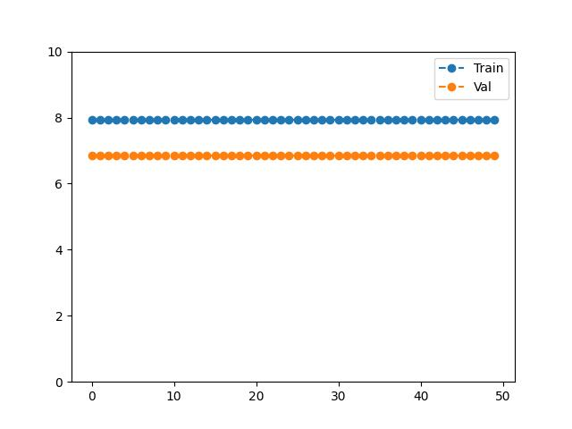
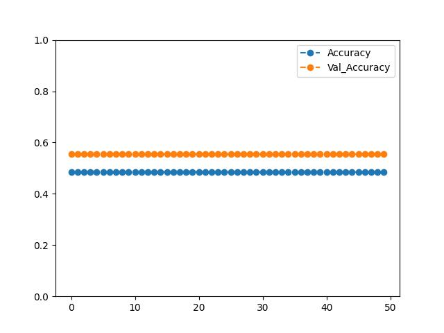

# Test Example
Random Seed|Test Split|Activation|Optimizer|LSTM Units|Learning Rate|Batchsize|Epochs
 --- | --- | --- | --- | --- | --- | --- | --- 
42|0.2|sigmoid|Adam|50|0.0005|16|50

Train Loss:

7.9279069900512695
7.927906036376953
7.9279069900512695
7.927906036376953
7.927906036376953
7.927906036376953
7.927906036376953
7.927906036376953
7.927906036376953
7.927906036376953
7.927906036376953
7.927906036376953
7.927906036376953
7.927906036376953
7.927906036376953
7.927906036376953
7.927906036376953
7.9279069900512695
7.927905559539795
7.927906036376953
7.9279069900512695
7.9279069900512695
7.9279069900512695
7.9279069900512695
7.9279069900512695
7.927906036376953
7.927906036376953
7.9279069900512695
7.927906036376953
7.927906036376953
7.9279069900512695
7.927905559539795
7.927906036376953
7.927906036376953
7.9279069900512695
7.927905559539795
7.927906036376953
7.9279069900512695
7.927906036376953
7.927906036376953
7.927906036376953
7.927906036376953
7.927906036376953
7.927906036376953
7.927906036376953
7.9279069900512695
7.927906036376953
7.9279069900512695
7.927906036376953
7.927906036376953

Val Loss:

6.855532646179199
6.855532646179199
6.855532646179199
6.855532646179199
6.855532646179199
6.855532646179199
6.855532646179199
6.855532646179199
6.855532646179199
6.855532646179199
6.855532646179199
6.855532646179199
6.855532646179199
6.855532646179199
6.855532646179199
6.855532646179199
6.855532646179199
6.855532646179199
6.855532646179199
6.855532646179199
6.855532646179199
6.855532646179199
6.855532646179199
6.855532646179199
6.855532646179199
6.855532646179199
6.855532646179199
6.855532646179199
6.855532646179199
6.855532646179199
6.855532646179199
6.855532646179199
6.855532646179199
6.855532646179199
6.855532646179199
6.855532646179199
6.855532646179199
6.855532646179199
6.855532646179199
6.855532646179199
6.855532646179199
6.855532646179199
6.855532646179199
6.855532646179199
6.855532646179199
6.855532646179199
6.855532646179199
6.855532646179199
6.855532646179199
6.855532646179199

Accuracy

0.48603352904319763
0.48603352904319763
0.48603352904319763
0.48603352904319763
0.48603352904319763
0.48603352904319763
0.48603352904319763
0.48603352904319763
0.48603352904319763
0.48603352904319763
0.48603352904319763
0.48603352904319763
0.48603352904319763
0.48603352904319763
0.48603352904319763
0.48603352904319763
0.48603352904319763
0.48603352904319763
0.48603352904319763
0.48603352904319763
0.48603352904319763
0.48603352904319763
0.48603352904319763
0.48603352904319763
0.48603352904319763
0.48603352904319763
0.48603352904319763
0.48603352904319763
0.48603352904319763
0.48603352904319763
0.48603352904319763
0.48603352904319763
0.48603352904319763
0.48603352904319763
0.48603352904319763
0.48603352904319763
0.48603352904319763
0.48603352904319763
0.48603352904319763
0.48603352904319763
0.48603352904319763
0.48603352904319763
0.48603352904319763
0.48603352904319763
0.48603352904319763
0.48603352904319763
0.48603352904319763
0.48603352904319763
0.48603352904319763
0.48603352904319763

Value Accuracy:

0.5555555820465088
0.5555555820465088
0.5555555820465088
0.5555555820465088
0.5555555820465088
0.5555555820465088
0.5555555820465088
0.5555555820465088
0.5555555820465088
0.5555555820465088
0.5555555820465088
0.5555555820465088
0.5555555820465088
0.5555555820465088
0.5555555820465088
0.5555555820465088
0.5555555820465088
0.5555555820465088
0.5555555820465088
0.5555555820465088
0.5555555820465088
0.5555555820465088
0.5555555820465088
0.5555555820465088
0.5555555820465088
0.5555555820465088
0.5555555820465088
0.5555555820465088
0.5555555820465088
0.5555555820465088
0.5555555820465088
0.5555555820465088
0.5555555820465088
0.5555555820465088
0.5555555820465088
0.5555555820465088
0.5555555820465088
0.5555555820465088
0.5555555820465088
0.5555555820465088
0.5555555820465088
0.5555555820465088
0.5555555820465088
0.5555555820465088
0.5555555820465088
0.5555555820465088
0.5555555820465088
0.5555555820465088
0.5555555820465088
0.5555555820465088
